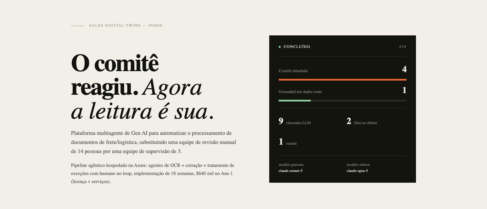

# Sales Digital Twins — Hierarchical Multi-Agent Stakeholder Debate



A multi-agent Python system, hierarchically orchestrated via LangGraph,
that simulates debates between personas on a buying committee (CFO, CTO,
Procurement, Champion, etc.) to help sales reps stress-test a pitch,
anticipate objections, and calibrate their talk track before a real meeting.

## 🎬 "The Room"

Every B2B seller knows that room. It's where the biggest deal of the
quarter gets decided, with the CFO, the CTO, and Procurement on the other
side of the table — and one shot to convince them. The problem is that
committee exists to tear proposals apart: every number gets questioned,
every promise gets tested, and the seller almost always finds out where
their pitch had holes too late, after the "no" has already been said. The
real rehearsal happens at the wrong time, in front of the wrong people.

Sales Digital Twins was born from a simple question: what if you could
walk into that room before the room? Instead of discovering objections in
the actual meeting, the seller faces them beforehand — against a synthetic
buying committee that behaves like the real one. Each stakeholder is a
digital twin: when real account data exists (from LinkedIn, CRM, or
automatic research via EXA), the persona is grounded in those facts; when
it doesn't, it falls back to a curated archetype for that role. These
aren't generic stereotypes — they're personas anchored in real market
context.

And they don't go easy. The seller pastes their own opening pitch and the
committee reacts to their exact words — the CFO demands the numbers behind
a "payback in 3 months," the CTO attacks the integration, Procurement
demands a benchmark. All of it orchestrated by a Facilitator that decides
who speaks, when to escalate a blocking objection, and when the debate has
run its course — a real meeting-room dynamic, not isolated answers.

In the end, the product delivers what matters: an actionable verdict. A
MEDDPICC scorecard shows where the deal stands and where it's at risk;
and, when the seller tested their own pitch, a coach evaluates their
performance — what landed, what backfired, and exactly what to say next
time, with line-by-line rewrites. The seller walks back into the real room
with the posture of someone who's already been there.

That's the promise the product delivers on: **rehearse the worst committee
of your life, before it's real.**

---

Runs in **two modes**, on the same pipeline:

- **Deal war-gaming** (autonomous): the committee debates your proposal on
  its own and you read the report. "Before the call, see how the committee
  is going to tear your deal apart."
- **Training simulator** (with your own pitch): you paste your opening
  pitch, the personas react to your **real words**, and a **Coach**
  evaluates how the pitch held up and rewrites the weak lines.

## Core concept: real → archetype fallback

For each role on the committee (`AccountContext.roles_in_committee`):

- If `AccountContext.real_data[role]` has facts (from CRM, call
  transcripts, LinkedIn, email), the persona is built as `DataSource.REAL`,
  with those facts injected directly into the agent's system prompt.
- If there's no data, it automatically falls back to `DataSource.ARCHETYPE`
  — a generic persona curated in `digital_twins/personas/archetypes.py`.

This means the same pipeline works both for **generic training** (no real
data, every persona is an archetype) and for **real account intelligence**
(CFO grounded in real data, the rest archetypes) — with no need to switch
systems.

## Architecture (hierarchical)

```
START → start_round (Facilitator sets the speaking order)
            ↓
        persona_turn (one persona speaks at a time, reacting to what's been said)
            ↓ (loop until everyone has spoken in the round)
        evaluate_round (Facilitator judges: continue / escalate / conclude)
            ↓
   ┌────────┴────────┐
   ↓ (continue/escalate)     ↓ (conclude)
 start_round (new round)     synthesize → END
```

The `Facilitator` is the supervisor: it decides speaking order and
whether the debate should continue, escalate (reorder to give the final
word to the highest-veto stakeholder who raised a blocker), or conclude.
The personas have no orchestration logic — they only generate
in-character content.

## Seller's opening pitch + Coach (MEDDPICC)

The optional `AccountContext.seller_opening` field holds the **seller's
actual statement** (the pitch as they'll really say it, in their own
words):

- **Blank** → the committee debates autonomously (war-gaming), reacting
  only to the abstract `pitch_summary`. Default behavior, unchanged.
- **Filled in** → each persona reacts to the seller's **exact words**, and
  the Synthesizer becomes a **Coach**: besides the committee's verdict, it
  evaluates the seller's performance (`DebateVerdict.seller_coaching`) —
  pitch grade, what landed, what backfired, and concrete line-by-line
  rewrites ("instead of X, say Y because Z").

In both modes, the verdict also carries a **MEDDPICC scorecard**
(`DebateVerdict.meddpicc_scorecard`) covering the dimensions the debate
revealed (Metrics, Economic Buyer, Identify Pain, Champion). All of this
is additive: without `seller_opening`, the Synthesizer's prompt is
byte-for-byte the usual one and `seller_coaching` stays `None`.

## Status

✅ **Web UI (Next.js + FastAPI)** — the primary frontend, in `web/` +
`api/`, with its own design system ("Ledger") applied to the report: the
clay/mint pair visually distinguishes what was **measured** (committee
count, grounded personas, duration, number of LLM calls) from what was
**generated by the LLM** (objections, verdict, MEDDPICC scorecard).
- The backend (`api/main.py`) is a thin HTTP layer over the same
  `digital_twins/` engine — no debate logic was duplicated.
- The frontend (`web/`) consumes the API and runs the full flow: Setup →
  Run → Result (ledger, grounding callout, archetype flag, transcript,
  verdict, export).
- The previous **Streamlit** UI has been archived under `legacy/`
  (`legacy/streamlit_app.py`, `legacy/app_v2.py`) — see below.

## Local setup — Web UI (Next.js + FastAPI)

```bash
# 1. Backend: create the virtualenv and install dependencies
python3 -m venv .venv
source .venv/bin/activate        # Windows: .venv\Scripts\activate
pip install -r requirements.txt

# 2. Configure the Anthropic key (it's passed per request, never persisted)
cp .env.example .env
# edit .env and fill in ANTHROPIC_API_KEY=sk-ant-...

# 3. Start the API
uvicorn api.main:app --reload --port 8000

# 4. In another terminal, start the frontend
cd web
npm install
npm run dev
# opens at http://localhost:3000 — the API key can also be typed
# directly into the form (only kept in memory during the run)
```

## Legacy Streamlit UI

Before the Next.js + FastAPI stack above, the project shipped as a
Streamlit app — including a pixel-art "Office Canvas" (an animated meeting
room where each persona is a character at a desk) that hasn't been ported
to the new frontend yet. It's archived under `legacy/`, still fully
functional, and kept around for that canvas:

```bash
# From the same virtualenv/requirements.txt used by the Web UI above:
streamlit run legacy/streamlit_app.py
# or the version with a navigation bar:
streamlit run legacy/app_v2.py
```

See `legacy/README_APP_V2.md` for the full tour (tabs, Office Canvas
architecture, the feedback loop, and the legacy design tokens).

## CLI

```bash
# Needs ANTHROPIC_API_KEY (in .env or exported):
python -m digital_twins.main -v

# With a real account (JSON in the AccountContext shape, e.g. accounts/ifood.json):
python -m digital_twins.main --account accounts/ifood.json -v
```

Every run writes a `.md` report, an `.html` one (styled, see the section
below), and a `.json` snapshot (`SimulationRecord`, used by post-call
calibration) into `reports/`.

## What-if scenarios ("branch, simulate, compare")

Instead of a single debate, declare N deal variants (price A vs. B,
with/without a POC, anchor on ROI vs. risk) in a JSON file — each one is a
"branch" of the base `AccountContext` that only carries the delta — and
run them all at once:

```bash
python -m digital_twins.main --scenarios accounts/cenarios_exemplo.json
```

This produces a side-by-side comparison in
`reports/<account>-scenarios-<ts>.md`, ranked by an aggregate risk score
(overall sentiment + number of blockers + lack of consensus), with the
recommended scenario at the top.

## Post-call calibration (twin vs. reality)

After the real call happens, compare what the twin PREDICTED against what
was actually said:

```bash
python -m digital_twins.calibration \
  --simulation reports/<account>-<ts>.json \
  --call-transcript call.txt \
  --out reports/calibration.md
```

The report shows: per-persona fidelity (predicted objections that
actually came up), blind spots (real objections that weren't predicted),
and concrete suggestions for facts to add to `AccountContext.real_data` —
closing the twin's continuous-improvement loop.

## Automatic stakeholder research (EXA)

In the "Enter manually" form (both the Web UI and the legacy Streamlit
one), instead of typing in known facts about the real stakeholder by
hand, you can provide an **EXA API key** (optional) and click "🔎 Research
facts with EXA" — `digital_twins/research.py` uses Exa's Answer API to
pull public, specific, cited facts about the person (the same kind of
research done manually for the iFood test account, now automated).

## Tests

```bash
pytest tests/ -v
```

`PersonaFactory` tests always run (no LLM involved). The full-graph test
(`test_full_graph_runs_end_to_end_with_real_client`) needs
`ANTHROPIC_API_KEY` configured — there's no mock in the project, so it's
skipped automatically if the key isn't present.

## Model per layer (cost)

Configurable via env (`digital_twins/config.py`) — everything uses
**Haiku 4.5** by default to reduce cost:

- `DT_PERSONA_MODEL` — each persona's statements (high volume). Default: `claude-haiku-4-5-20251001`.
- `DT_FACILITATOR_MODEL` / `DT_SYNTHESIZER_MODEL` — convergence judgment
  and final synthesis. Default: `claude-haiku-4-5-20251001` (swap to
  `claude-sonnet-5` if you want higher quality on these two nodes).

## Language

The entire pipeline — UI, CLI, reports, and the prompts that generate the
personas' statements — runs in English. The only tokens that stay in
English by design are internal enum values used for code parsing (e.g.
the `SENTIMENT: supportive|neutral|skeptical|blocking` tag and the
`decision`/role values in the facilitator's and synthesizer's JSON) —
those never surface to the end user, they only flow between graph nodes.

**Translation safety net** (`digital_twins/i18n.py`): even with prompts in
English, LLMs occasionally slip into another language in short snippets.
`to_en()`/`to_en_list()` detect the language (`langdetect`) and
automatically translate (`deep-translator`/Google Translate) any persona
statement, objection, talk-track item, or risk summary that isn't in
English — applied in `persona_agent.py` and `synthesizer.py`. It fails
safe: if detection/translation errors out (no network, text too short),
the original text is kept instead of breaking the debate.

## Evolution roadmap (5 agents)

Mapped against the conceptual 5-agent architecture of a synthetic-persona
system:

| # | Conceptual agent | Current implementation | Status |
|---|---|---|---|
| 1 | Data Harvester | `research.py` (EXA Answer API) | Partial (manual form only) |
| 2 | Profiler | `PersonaFactory` + real/archetype fallback | ✅ |
| 3 | Digital Twin (Actor) | `persona_agent.py` (reacts to `seller_opening`) | ✅ |
| 4 | Moderator | `Facilitator` (hierarchical graph + escalation) | ✅ |
| 5 | Coach / Evaluator | `synthesizer.py` (MEDDPICC + `seller_coaching`) | ✅ |

- **Phase 1 (done)** — seller's opening pitch: personas react to real
  words.
- **Phase 2 (done)** — Coach evaluates the seller's pitch against the
  objections.
- **Phase 3 (backlog)** — turn-by-turn interactive mode: LangGraph's
  `interrupt()` + `MemorySaver` so the seller can respond each round, with
  replay and branching. **Changes the graph's topology** (from a single
  `invoke` to pausable execution), so it's a separate decision.

Other backlog items:

1. **Real-data connector**: extend EXA research (today only in the manual
   form) to also enrich accounts loaded via JSON, cross-referencing the
   stakeholder with the company's macro context.
2. **Governance guardrail**: when using `DataSource.REAL` over identifiable
   real people, define an explicit consent and data-retention policy
   before production (see `legal:compliance-check`).
3. **Evaluation**: an annotated debate dataset to measure whether generated
   objections match real objections collected post-call
   (objection precision/recall).

The downloadable `.md`/`.html` reports (`digital_twins/reporting.py`) use
the same Ledger design system as the Web UI — see the "Status" section
above and `web/app/globals.css`. The legacy Streamlit UI's own in-app
screens (not the reports) still use an older proprietary palette; see
`legacy/README_APP_V2.md` for its tabs, the pixel-art Office Canvas
architecture, and the feedback loop it implements.
